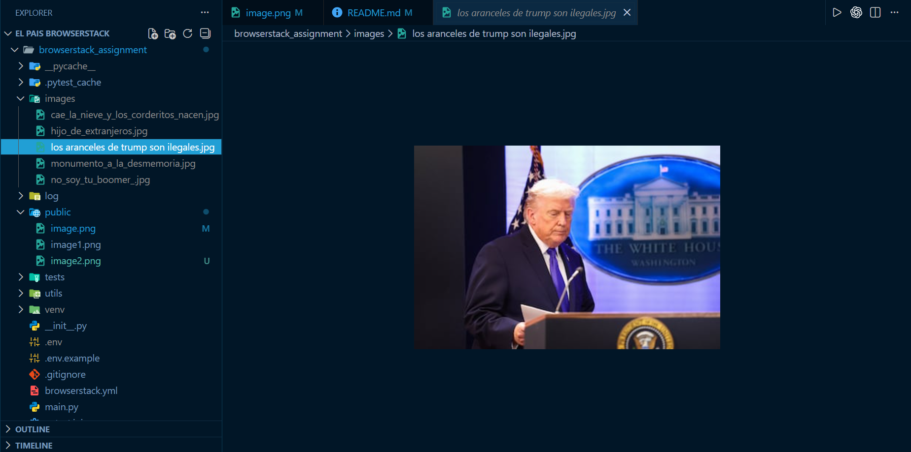
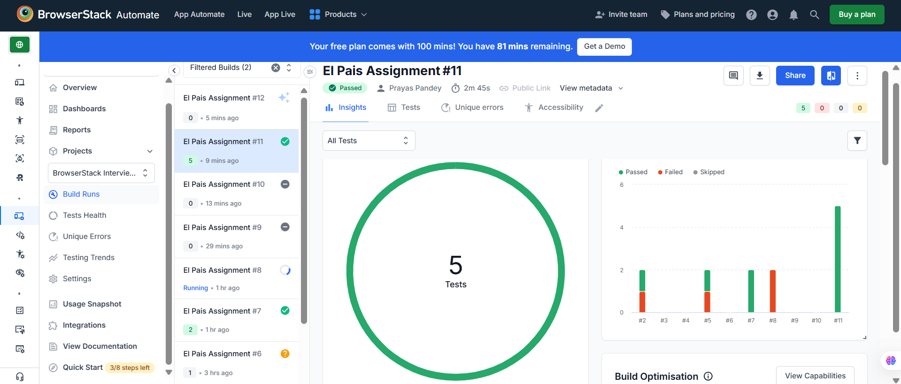
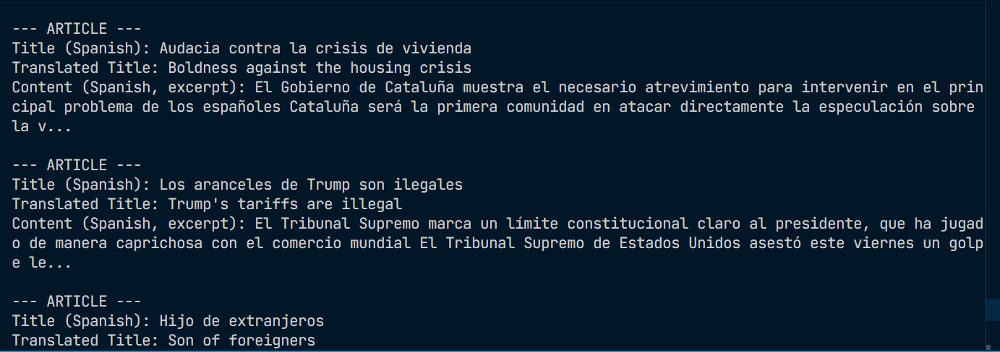

# 📰 El País Opinion Scraper & Cross-Browser Analyzer

An automated web scraping pipeline that extracts articles from the **Opinion section of [El País](https://elpais.com/opinion/)**, translates their titles to English, performs word frequency analysis, and demonstrates cross-browser testing on **BrowserStack**.

---

## ✨ Features

| Feature                   | Description                                                                                           |
| ------------------------- | ----------------------------------------------------------------------------------------------------- |
| **Article Scraping**      | Navigates to El País Opinion section, handles cookie consent, and scrapes the first 5 unique articles |
| **Paywall Resilience**    | Gracefully handles paywalled articles using multi-selector fallback extraction                        |
| **Image Download**        | Downloads article cover images locally with sanitized filenames                                       |
| **Translation**           | Translates article titles from Spanish → English via RapidAPI Google Translate 113                    |
| **Word Analysis**         | Identifies words repeated 3+ times across translated titles (with stopword filtering)                 |
| **Cross-Browser Testing** | Runs on BrowserStack across Chrome, Firefox, Safari, and mobile devices                               |

---

## 📋 Prerequisites

- **Python 3.8+**
- **pip** (Python package installer)
- **Google Chrome** (or Firefox/Edge for local runs)
- **RapidAPI Key** — Subscribe to the [Google Translate 113 API](https://rapidapi.com/gatz/api/google-translate113) on RapidAPI
- **BrowserStack Account** _(optional, for cloud testing)_ — [Sign up here](https://www.browserstack.com/)

---

## 🚀 Setup

### 1. Clone & Navigate

```bash
git clone https://github.com/your-username/browserstack-assignment.git
cd browserstack-assignment
```

### 2. Create Virtual Environment

```bash
python -m venv venv
```

**Activate it:**

- **Windows:** `.\venv\Scripts\activate`
- **macOS/Linux:** `source venv/bin/activate`

### 3. Install Dependencies

```bash
pip install -r requirements.txt
```

### 4. Configure Environment Variables

Copy `.env.example` to `.env` and fill in your credentials:

```env
# BrowserStack credentials (optional — only needed for cloud testing)
BROWSERSTACK_USERNAME=your_username
BROWSERSTACK_ACCESS_KEY=your_access_key

# Required — RapidAPI key for translation
RAPIDAPI_KEY=your_rapidapi_key
```

---

## ▶️ Usage

### Run Locally

```bash
python main.py
```

This will:

1. Launch a Chrome browser and navigate to [El País Opinion](https://elpais.com/opinion/)
2. Handle any cookie consent popups automatically
3. Scrape the first 5 unique opinion articles
4. For each article:
   - Extract the title (and content if accessible — some articles may be paywalled)
   - Translate the title from Spanish to English
   - Download the cover image to the `images/` directory
5. Analyze all translated titles for words repeated 3+ times
6. Print a summary of the analysis

### Run on BrowserStack

Ensure your `.env` has `BROWSERSTACK_USERNAME` and `BROWSERSTACK_ACCESS_KEY` configured, then:

```bash
browserstack-sdk pytest tests/test_el_pais.py
```

> **Note (Windows):** If `browserstack-sdk` is not on your PATH, use the full path:
>
> ```bash
> ".\venv\Scripts\browserstack-sdk.exe" pytest tests/test_el_pais.py
> ```

The test suite runs across the platforms defined in `browserstack.yml`:

| Platform           | Browser          |
| ------------------ | ---------------- |
| Windows 11         | Chrome (latest)  |
| macOS Ventura      | Safari (latest)  |
| Windows 10         | Firefox (latest) |
| Samsung Galaxy S22 | Chrome           |
| iPhone 14          | Safari           |

Results are available on your [BrowserStack Automate Dashboard](https://automate.browserstack.com/).

---

## 🗂️ Project Structure

```
browserstack_assignment/
├── main.py                  # Entry point — orchestrates scraping, translation & analysis
├── utils/
│   ├── scraper.py           # Selenium-based web scraping with paywall-resilient extraction
│   ├── translator.py        # RapidAPI Google Translate integration
│   └── analyzer.py          # Word frequency analysis with stopword filtering
├── tests/
│   ├── conftest.py          # Pytest fixtures (local & BrowserStack driver setup)
│   └── test_el_pais.py      # End-to-end test suite with BrowserStack status reporting
├── browserstack.yml         # BrowserStack platform configuration (5 platforms)
├── pytest.ini               # Pytest configuration and custom markers
├── requirements.txt         # Python dependencies
├── .env.example             # Template for environment variables
├── .gitignore               # Git ignore rules
├── images/                  # Downloaded article cover images (git-ignored)
├── log/                     # BrowserStack SDK logs (git-ignored)
└── public/                  # Sample screenshots and reference images
```

---

## 🔧 How It Works

```
┌─────────────────┐     ┌──────────────┐     ┌───────────────┐     ┌──────────────┐
│  Navigate to    │────▶│  Scrape 5    │────▶│  Translate    │────▶│   Analyze    │
│  El País        │     │  Articles    │     │  Titles       │     │   Word Freq  │
│  /opinion/      │     │  (paywall-   │     │  ES → EN      │     │   (≥3 reps)  │
│                 │     │   resilient) │     │               │     │              │
└─────────────────┘     └──────────────┘     └───────────────┘     └──────────────┘
                              │
                              ▼
                        ┌──────────────┐
                        │  Download    │
                        │  Cover       │
                        │  Images      │
                        └──────────────┘
```

### Paywall Handling

El País articles may be behind a subscription wall. The scraper handles this gracefully:

1. **Multi-selector extraction** — Tries 4 CSS selectors in order of specificity (`article .a_c p` → `[data-dtm-region] p` → `article .article_body p` → `article p`)
2. **Fallback extraction** — If no paragraphs are found, extracts all visible text from the `<article>` element
3. **Title-first processing** — Articles are processed as long as a title can be extracted, even if content is fully paywalled

---

## 📸 Sample Output Screenshots






---

## 🔍 Troubleshooting

| Issue                                                        | Solution                                                                                               |
| ------------------------------------------------------------ | ------------------------------------------------------------------------------------------------------ |
| `TimeoutException` during scraping                           | Page took too long to load. The script handles this gracefully by skipping the article                 |
| `Content: [Not available — article may be behind a paywall]` | Normal behavior for subscriber-only articles. Titles and images are still extracted                    |
| `browserstack-sdk` not found                                 | Ensure your venv is active. Use the full path to the executable if needed                              |
| Missing `RAPIDAPI_KEY`                                       | Translation falls back to returning the original Spanish text                                          |
| "No words appeared frequently enough"                        | Normal if translated titles don't share 3+ repeated words after stopword filtering                     |
| Chrome fails to launch                                       | Ensure [ChromeDriver](https://chromedriver.chromium.org/) is installed and matches your Chrome version |
